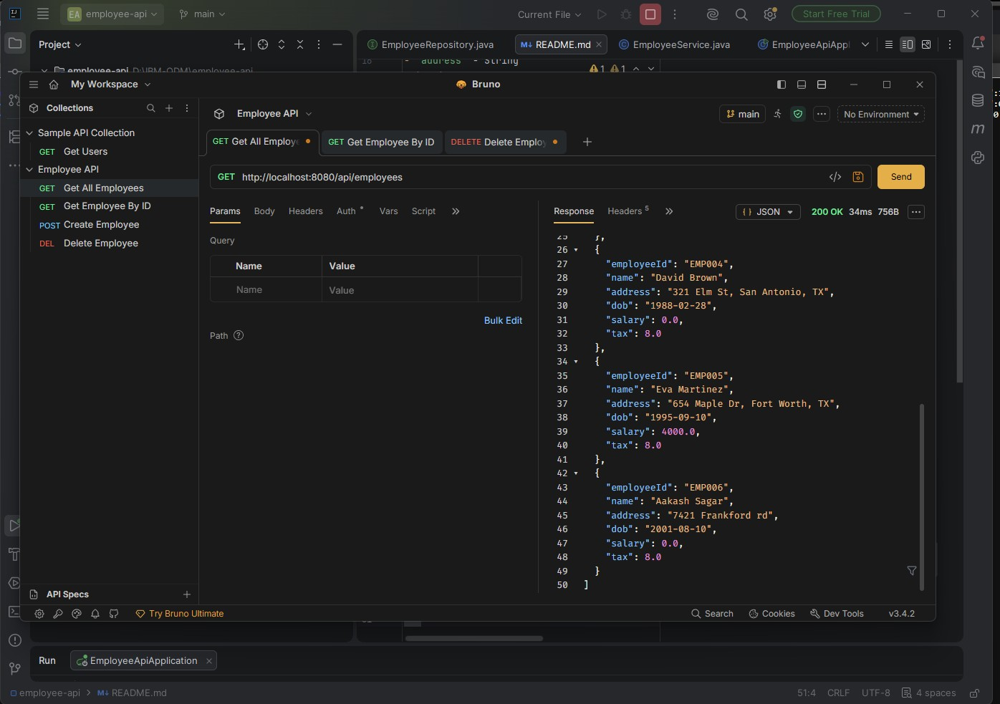
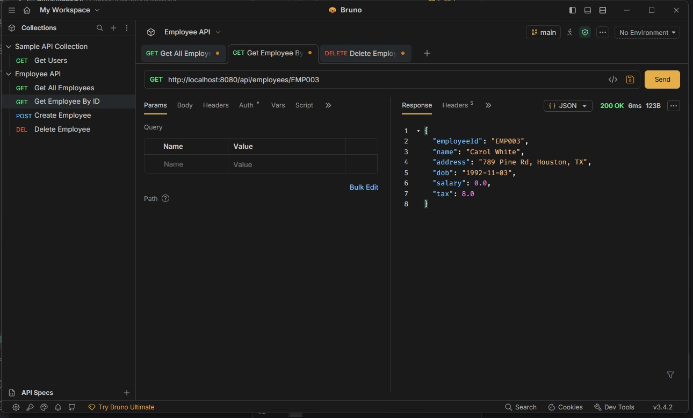
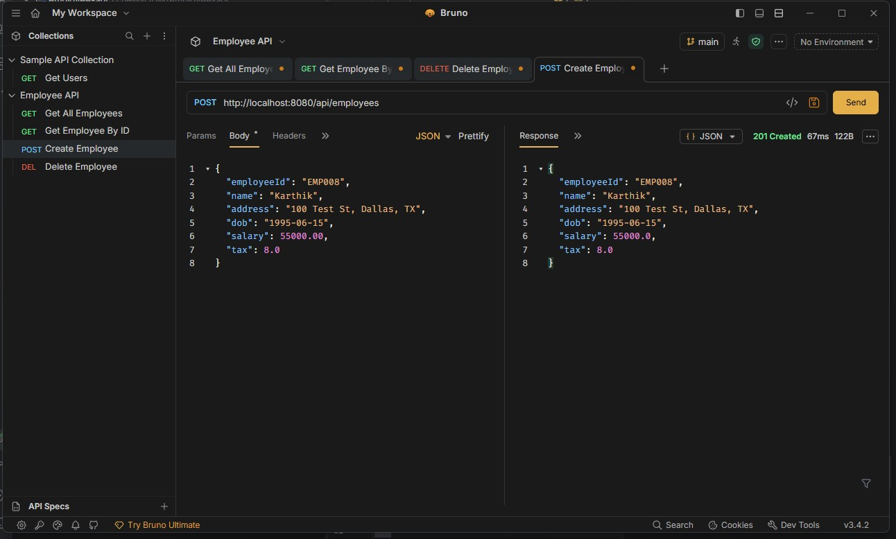
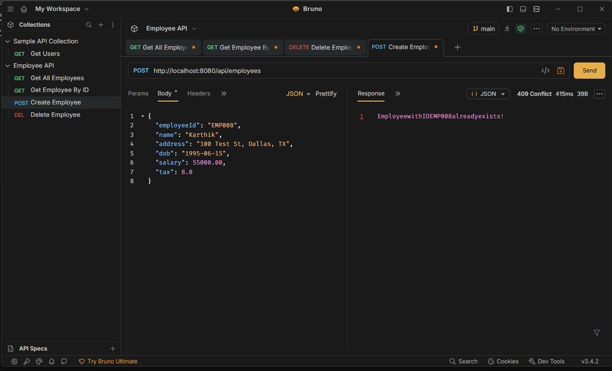
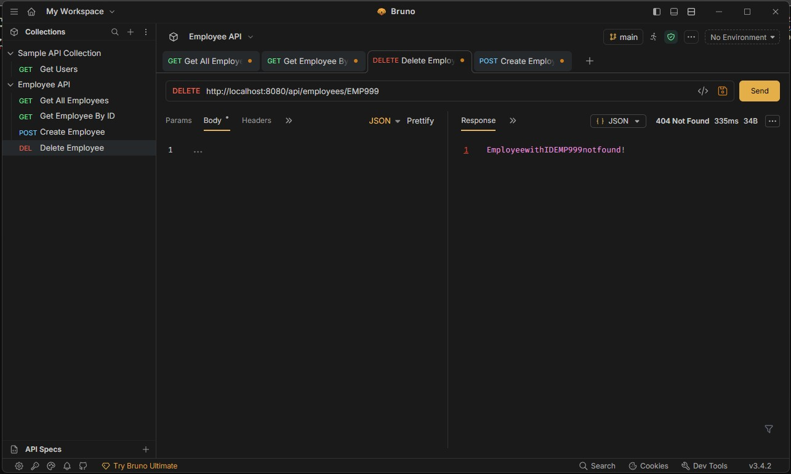
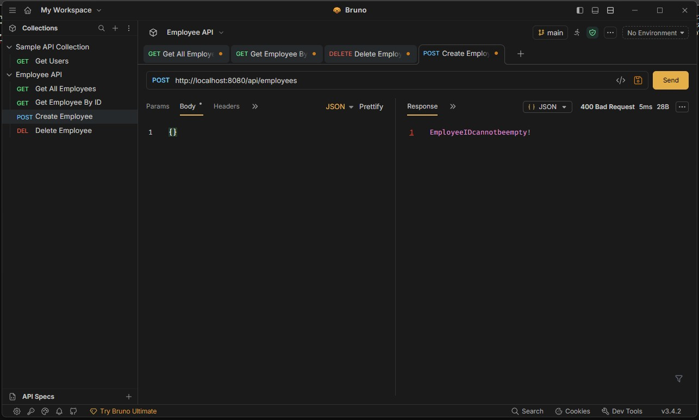

# Employee CRUD API

Spring Boot REST API for Employee CRUD operations using MySQL.

## Tech Stack
- Java 17
- Spring Boot
- Spring Data JPA
- MySQL
- Maven
- Bruno (API Testing)

## Employee Fields
- `employeeId` - String (e.g. EMP001)
- `name` - String
- `address` - String
- `dob` - Date
- `salary` - Double
- `tax` - Double

## Database Setup
Run the SQL script in MySQL Workbench:
```sql
SOURCE database/employee_db.sql;
```
Then update your password in `src/main/resources/application.properties`

## Run The Application
Open the project in IntelliJ and click the Run button.
API runs at: `http://localhost:8080`

## API Endpoints
| Method | URL | Description |
|--------|-----|-------------|
| GET | /api/employees | Get all employees |
| GET | /api/employees/{id} | Get employee by ID |
| POST | /api/employees | Create new employee |
| PUT | /api/employees/{id} | Update employee |
| DELETE | /api/employees/{id} | Delete employee |

## API Test Results

### 1. Get All Employees
- **Request:** GET /api/employees
- **Response:** 200 OK
  

### 2. Get Employee By ID
- **Request:** GET /api/employees/EMP001
- **Response:** 200 OK
  

### 3. Create Employee
- **Request:** POST /api/employees
- **Response:** 201 Created
  

### 4. Duplicate ID Error
- **Request:** POST /api/employees (with existing ID)
- **Response:** 409 Conflict
- **Message:** `Employee with ID already exists!`
  

### 5. Delete Non-Existing Employee
- **Request:** DELETE /api/employees/EMP999
- **Response:** 404 Not Found
- **Message:** `Employee with ID not found!`
  

### 6. Empty Employee Creation
- **Request:** POST /api/employees with empty body
- **Response:** 400 Bad Request
- **Message:** `Employee ID cannot be empty!`
  


#### Example Response:
```json
{
  "employeeId": "EMP006",
  "name": "Aakash Sagar",
  "age": 25,
  "eligible": true,
  "status": "Eligible",
  "reason": "Age 25 is within eligible range (25-45)."
}
```

## Test Employees for Eligibility
| Employee ID | Name | DOB | Age | Expected Status |
|-------------|------|-----|-----|-----------------|
| EMP006 | Aakash Sagar | 2001-06-04 | 25 (today!) | ✅ Eligible (Boundary Case) |
| EMP009 | Young Test | 2005-01-01 | 21 | ❌ Ineligible (Too Young) |
| EMP010 | Mid Test | 1975-01-01 | 51 | ✅ Considerable (45-55) |
| EMP011 | Senior Test | 1965-01-01 | 61 | ❌ Ineligible (Too Old) |